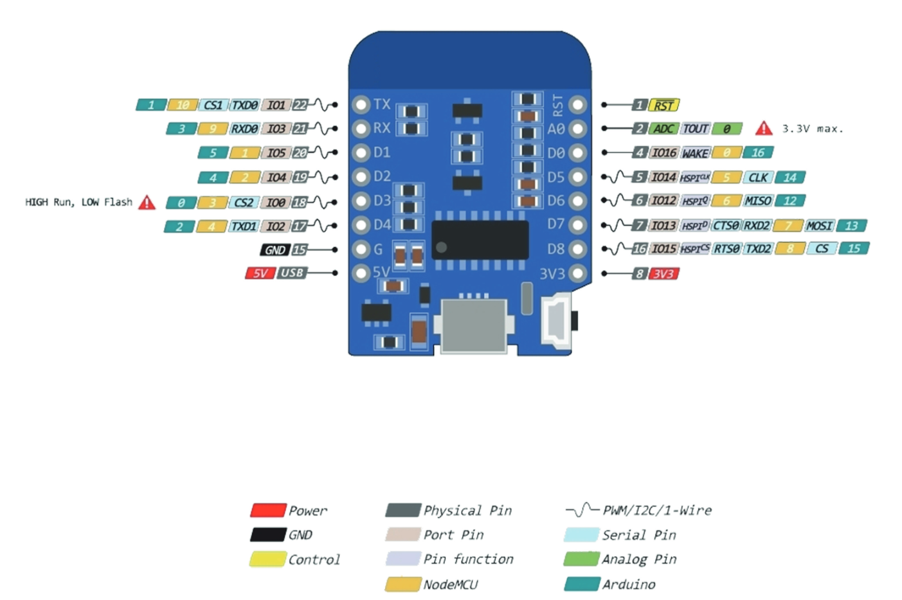

# Berlin Clock

## Platform
[Az-Delivery D1-Mini (ESP8266 based) ](https://www.az-delivery.de/en/products/d1-mini)

### Pinout


## platformio commands

Init Project:
```shell
platformio init --board d1_mini
```

Compile:
```shell
platformio run -e d1_mini
```

Upload to ESP:
Compile:
```shell
platformio run -e d1_mini --target upload
```

Run tests:
Compile:
```shell
platformio test -e native
```

Link to kata: https://agilekatas.co.uk/katas/BerlinClock-Kata